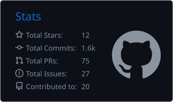
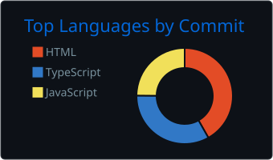
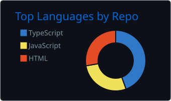

<!--
  This repo (mncoleman/mncoleman) is BOTH my GitHub profile README and the
  source for my website. Top half = about me. Bottom half = the website.
-->

<div align="center">

<a href="https://mncoleman.com">
  
</a>

<p>
  <a href="https://mncoleman.com"></a>
  <a href="https://www.linkedin.com/in/matthew-coleman-15a66b233/"></a>
  <a href="https://x.com/mncoleman_"></a>
  <a href="https://www.instagram.com/mncoleman_/"></a>
  
</p>

</div>

## About Me

> Welcome! I'm **Matthew Coleman** — this is my small corner of the internet, where I collect my thoughts, projects, and experiences. I hope you enjoy your stay.

- Deeply passionate about **technology, AI, and the vast world of digital possibilities**
- I love **rapid development** — building and shipping real things fast, often with AI as a co-pilot (**Claude**)
- I share thoughts, experiences, and technical knowledge over at **[mncoleman.com](https://mncoleman.com)**
- Lately playing with **WebGL / 3D**, motion design, and **Notion-powered** content pipelines

### Tech I Reach For

<div align="center">
  
</div>

### GitHub Stats

<div align="center">

  

  <br />

  
  

  <br />

  

</div>

---

<div align="center">

# My Website

**This profile lives in the same repo that powers [mncoleman.com](https://mncoleman.com)** — a modern, minimalist personal site featuring a blog, projects, resources, AI prompts & skills, artifacts, and a professional resume, all powered by Notion CMS and Next.js.

[](https://github.com/mncoleman/mncoleman/actions/workflows/deploy.yml)
[](https://nextjs.org/)
[](https://www.typescriptlang.org/)
[](https://www.notion.so/)
[](https://tailwindcss.com/)

[Live Site](https://mncoleman.com) · [Report Bug](https://github.com/mncoleman/mncoleman/issues) · [Request Feature](https://github.com/mncoleman/mncoleman/issues)

</div>

---

## Features

<table>
<tr>
<td width="50%">

### Design & UX

- **WebGL Backgrounds** - Dark Veil shader (OGL) in dark mode, a canvas wave field in light
- **3D Glass Cubes** - Interactive bento grid on desktop (pure CSS 3D transforms, no 3D library)
- **Sticky Card Stack** - Scroll-driven mobile home page
- **Visitor Globe** - Interactive guestbook globe (cobe) on the home page
- **Frosted Glass UI** - Modern glassmorphism design
- **Page Transitions** - Smooth Motion-powered route transitions
- **Dark Mode** - System-aware theme switching
- **Custom Cursor** - Pointer-aware accent cursor
- **PWA Ready** - Installable progressive web app
- **100% Responsive** - Perfect on all devices

</td>
<td width="50%">

### Performance & Tech

- **Static Generation** - Lightning-fast pre-rendered pages
- **Global Search** - Pre-built search index with `Cmd/Ctrl+K`
- **Public MCP Server** - Model Context Protocol endpoint at `/mcp`
- **Keyboard Shortcuts** - Single-key navigation across the site
- **Type Safety** - Full TypeScript coverage
- **Zero Runtime** - 100% static export to GitHub Pages
- **Daily Auto-Rebuild** - Scheduled GitHub Actions workflow
- **Generated OG Images** - Per-route share cards, one design across both pipelines
- **Analytics Ready** - Google Analytics 4 integration

</td>
</tr>
</table>

### Content Management & Admin

| Feature | Description |
|---------|-------------|
| **Blog** | Notion-powered blog with markdown rendering & tag filtering |
| **Projects** | Notion-powered portfolio of things I've made |
| **Resources** | Curated link library grouped by multi-select categories |
| **Resume** | Notion page parsed into a structured card layout (hero, experience, education) |
| **Artifacts** | Two kinds: *static* files committed to `public/artifacts/`, and *instant* ones uploaded live to the artifact service |
| **"A"I Library** | Public prompts + skills at `/ai`, served from the artifact service |
| **Visitor Globe** | Public "where are you from" guestbook with bot defence and moderation |
| **Brand Kit** | Public brand assets and style reference page |
| **Featured Posts** | Pin important content to the top of the blog |
| **Secure Admin** | Telegram-authenticated dashboard backed by a Cloudflare Worker |
| **Content Sync** | Trigger rebuilds, edit "About Me", manage users, artifacts, library & visitors |

## Admin Dashboard

The site features a secure, hidden admin dashboard for managing content and deployments:

- **Telegram Authentication**: Secure login via Telegram widget (no passwords to manage).
- **One-Click Rebuilds**: Trigger GitHub Actions deployments directly from the dashboard.
- **Content Editing**: Edit the "About Me" section with a live preview editor.
- **Artifact Uploads**: Upload files (HTML, PDF, images) either as *static* artifacts committed to the repo or *instant* ones published live to the artifact service.
- **"A"I Library**: Author and publish prompts and skills.
- **Analytics**: GA4 figures read through the Worker with a service account.
- **Visitors**: Moderate the guestbook globe's pins.
- **User Management**: Manage allow-listed Telegram users. Roles are `admin` and `super_admin`; only `super_admin` can manage users or reveal private-artifact passwords.

The admin auth flow is handled by a Cloudflare Worker (`worker/index.ts`), which mints a
short-lived, audience-scoped JWT for each call it proxies to the artifact service. Sessions
are revalidated against KV per request, so removing a user takes effect immediately rather
than when their token expires.

> Access the dashboard at `/admin` (requires configuration — see [`ADMIN_SETUP.md`](./ADMIN_SETUP.md)).

---

## Quick Start

### Prerequisites

- Node.js 18+ and npm
- Notion account (for content management)

### Installation

```bash
# Clone the repository
git clone https://github.com/mncoleman/mncoleman.git
cd mncoleman

# Install dependencies
npm install

# Set up environment variables
cp .env.example .env.local
# Edit .env.local with your Notion credentials

# Start development server
npm run dev
```

Visit [http://localhost:3000](http://localhost:3000) to see your site.

---

## Configuration

### Environment Variables

Copy `.env.example` to `.env.local` and fill in your values:

```env
# Notion Integration (required for content)
NOTION_TOKEN=ntn_your_integration_token_here
NOTION_DATABASE_ID=your_blog_database_id
NOTION_RESOURCES_DATABASE_ID=your_resources_database_id
NOTION_RESUME_PAGE_ID=your_resume_page_id
NOTION_PROJECTS_DATABASE_ID=your_projects_database_id

# Google Analytics (optional)
NEXT_PUBLIC_GA_ID=G-XXXXXXXXXX

# Admin Dashboard (optional — required for /admin)
NEXT_PUBLIC_WORKER_URL=https://your-worker.workers.dev
NEXT_PUBLIC_TELEGRAM_BOT_NAME=your_bot_username

# Hosted services (optional — default to production)
NEXT_PUBLIC_ARTIFACTS_API_URL=https://artifacts.mncoleman.com
NEXT_PUBLIC_VISITOR_API_URL=            # falls back to ARTIFACTS_API_URL

# Local dev convenience (optional)
NEXT_PUBLIC_DISABLE_DARKVEIL=1          # what `npm run dev:lite` sets
```

If Notion credentials are **missing or set to placeholder values**, the data layer falls
back to sample content, so local development works with no `.env.local`.

If credentials are **present but a fetch fails**, the fetchers throw and the build fails on
purpose. `deploy.yml` runs unattended and deploys on success, so falling back there would
publish sample content over the live site; a failed build leaves the previous good deploy
serving. Transient failures (rate limits, 5xx) are retried first by `lib/notion-retry.ts`,
so only a sustained outage stops a build.

### Notion CMS Template (Quick Start)

**Use the pre-configured template to get started instantly:**

[](https://matthewcoleman.notion.site/Personal-Site-CMS-Template-2eac6cc793dc80789468f171f49604f3)

**What's Included:**

- ✅ **Blog Database** - Pre-configured with all required properties (Title, Slug, Date, Tags, Published, Featured, Excerpt, Author)
- ✅ **Resources Database** - Ready-to-use link library (Name, URL, Category, Description, Published)
- ✅ **Resume Page** - Formatted resume template with markdown blocks
- ✅ **Sample Content** - Example posts and resources to demonstrate the structure

**How to Use:**

1. Click the template link above and select "Duplicate" in the top-right corner
2. Create a Notion integration at [notion.so/my-integrations](https://www.notion.so/my-integrations)
3. Share all databases/pages with your integration
4. Copy the database/page IDs from the URLs and add to `.env.local`
5. Copy your integration token (starts with `ntn_`) to `.env.local`

### Manual Notion Setup (Without Template)

If you prefer to set up manually:

1. **Create a Notion Integration**
   - Go to [notion.so/my-integrations](https://www.notion.so/my-integrations)
   - Create new integration and copy the token (starts with `ntn_`)

2. **Set Up Databases / Pages**
   - **Blog database**: Title, Slug, Date, Tags, Published, Featured, Excerpt, Author
   - **Resources database**: Name, URL, Category (multi-select), Description, Published
   - **Projects database**: Name, Description, URL, Category, Published
   - **Resume page**: Single page with markdown content

3. **Share Databases**
   - Share each database/page with your integration
   - Copy the database/page IDs to `.env.local`

> See [`CLAUDE.md`](./CLAUDE.md) for the full schema reference and architecture
> notes.

---

## Tech Stack

<table>
<tr>
<td align="center" width="96">

<br>Next.js 16
</td>
<td align="center" width="96">

<br>TypeScript
</td>
<td align="center" width="96">

<br>Tailwind CSS
</td>
<td align="center" width="96">

<br>Notion API
</td>
<td align="center" width="96">

<br>GitHub Pages
</td>
</tr>
</table>

**Core Technologies:**

- **Framework**: Next.js 16 (App Router) with static export
- **Language**: TypeScript 5.9
- **Styling**: Tailwind CSS + shadcn/ui-style components, `@tailwindcss/typography`
- **CMS**: Notion API (`@notionhq/client`, `notion-to-md`)
- **Markdown**: `react-markdown` + `remark-gfm`, `@next/mdx`
- **Backend**: Cloudflare Workers (admin auth + a separate public MCP server) and a Bun + Hono artifact service
- **Graphics**: `ogl` for the Dark Veil shader, a hand-rolled canvas wave field for light mode, `cobe` for the visitor globe. The 3D glass-cube bento is pure CSS 3D transforms — there is no `three`/R3F dependency
- **Animation**: `motion` (Framer Motion successor), `gsap`, `lenis` for smooth scroll
- **Hosting**: GitHub Pages on a custom domain (`mncoleman.com`)
- **CI/CD**: GitHub Actions (push, daily cron, repository dispatch, manual)
- **Analytics**: Google Analytics 4 via `@next/third-parties`
- **PWA**: Service worker (`public/sw.js`) + Next.js `manifest.ts`

---

## How It Works: Notion CMS + Static Site Architecture

This site uses a unique architecture that combines **Notion's powerful CMS** with **100% static hosting** on GitHub Pages. Here's how it works:

### Four Independently Deployed Pieces

The repo looks like one project but ships as four, each on its own cadence. Knowing which
piece owns a behaviour is usually the fastest way to debug it.

| # | Piece | Where it runs | Deployed by |
|---|-------|---------------|-------------|
| 1 | **Next.js site** (repo root) | GitHub Pages, behind `mncoleman.com` | Push to `main` / daily cron |
| 2 | **`worker/`** — admin auth | Cloudflare Worker `mncoleman-admin-auth` | `cd worker && npx wrangler deploy` |
| 3 | **`worker-mcp/`** — public MCP server | Cloudflare Worker on `mncoleman.com/mcp` | `cd worker-mcp && npx wrangler deploy` |
| 4 | **`server/`** — artifacts + "A"I library | Bun + Hono container on an Oracle ARM box, `artifacts.mncoleman.com` | Docker image build + ship (see [`server/README.md`](./server/README.md)) |

A few consequences worth knowing up front:

- **Pushing to `main` deploys only piece 1.** The two Workers and the container are separate
  deploys. A change spanning them needs all of them shipped, and sometimes in a specific
  order — the admin Worker mints the JWT that the artifact service authorises against, so
  the Worker goes first.
- **The MCP server is a second Worker on purpose.** It is public and unauthenticated, and it
  owns a route on the Cloudflare-proxied apex so `/mcp*` is intercepted while every other
  path falls through to GitHub Pages. It stays separate from `worker/` because that one gates
  every POST behind an Origin allowlist and a CSRF header that MCP clients cannot send.
- **Only piece 4 has a database.** Everything else is stateless; the artifact service holds
  uploaded files, the "A"I library, and the visitor guestbook's SQLite file.

### The Build-Time CMS Approach

Unlike traditional CMS platforms that require a server to fetch content on every page load, this site fetches all content from Notion **once during the build process** and generates static HTML files.

```
┌─────────────┐      Build Time        ┌──────────────┐      Deploy        ┌─────────────┐
│   Notion    │ ──────────────────────>│  Next.js     │ ────────────────> │   GitHub    │
│  Databases  │   Fetch via API        │  Static      │   Upload HTML     │   Pages     │
│             │   Convert to Markdown  │  Generation  │   (out/ folder)   │  (Hosting)  │
└─────────────┘                        └──────────────┘                    └─────────────┘
     ↓                                         ↓                                  ↓
  Content                                  Pre-render                         Fast Delivery
  Management                               All Pages                          No Server Needed
```

### Benefits of This Approach

| Benefit | Description |
|---------|-------------|
| **Lightning Fast** | No API calls at runtime - all content is pre-rendered as HTML |
| **Zero Cost Hosting** | Static files hosted free on GitHub Pages |
| **Secure** | No server to hack, no databases to breach |
| **Easy Content Management** | Write in Notion's beautiful editor with rich formatting |
| **Global CDN** | GitHub Pages automatically distributes your site globally |
| **Works Offline** | PWA-ready static files can be cached for offline use |

### How Content Updates Work

**1. Edit Content in Notion**

- Open your Notion workspace
- Update blog posts, resources, or resume
- Changes are saved in Notion immediately

**2. Trigger a Rebuild**

- **Automatic**: GitHub Actions rebuilds daily at 6:00 AM UTC
- **Manual**: Trigger deployment from GitHub Actions tab
- **On Push**: Any commit to `main` branch triggers rebuild

**3. Build Process**

```bash
npm run build
```

- Next.js fetches latest content from Notion API
- Converts Notion blocks to Markdown using `notion-to-md`
- Generates static HTML files for all pages
- Outputs to `out/` directory

**4. Deploy to GitHub Pages**

- GitHub Actions uploads `out/` via `actions/upload-pages-artifact`
  and `actions/deploy-pages`
- Site updates at the custom domain (`mncoleman.com`, configured via
  `public/CNAME`)
- **No downtime** - atomic deployment

### Why This Architecture?

**Traditional CMS (WordPress, etc.)**

```
User Request → Server → Database Query → Render HTML → Send to User
❌ Slow (database queries on every request)
❌ Expensive (requires hosting server)
❌ Security risks (server + database vulnerabilities)
```

**This Site (Notion + Static)**

```
User Request → CDN → Serve Pre-rendered HTML → Done
✅ Fast (no server processing)
✅ Free (static file hosting)
✅ Secure (no server to attack)
```

### Key Technical Details

**Data Fetching** (`lib/notion.ts`, `lib/blog.ts`, `lib/projects.ts`,
`lib/resources.ts`, `lib/resume.ts`, `lib/artifacts.ts`)

- Uses `@notionhq/client` to query Notion databases
- Fetches only published content (filtered by "Published" checkbox)
- Validates credentials before connecting; falls back to sample data only when Notion is
  unconfigured, and throws when configured credentials hit a sustained failure

**Search Index** (`scripts/generate-search-index.ts`)

- Runs as part of `npm run build` before `next build`
- Aggregates blog posts, projects, resources, resume, and artifacts into
  `data/search-index.json`
- Powers the global `Cmd/Ctrl+K` search at runtime — no API calls needed

**Markdown Conversion** (`notion-to-md`)

- Converts Notion's block structure to Markdown
- Preserves formatting (bold, italic, links, code blocks)
- Handles images, lists, headings, and more

**Static Generation** (Next.js `output: 'export'`)

- Pre-renders all pages at build time
- No server-side rendering (SSR) or API routes
- Pure HTML/CSS/JS files in `out/`

**Content Refresh**

- Daily automatic rebuilds keep content fresh
- The Cloudflare Worker can dispatch a `repository_dispatch` event from the
  admin dashboard to trigger an immediate rebuild
- Content updates require a rebuild (~1–2 minutes)

### Trade-offs

**Advantages:**

- ✅ Blazing fast performance
- ✅ Free hosting
- ✅ No server maintenance
- ✅ Easy content editing in Notion

**Limitations:**

- Content updates require rebuild (~1-2 minutes)
- Not real-time (scheduled or manual deploys)
- Build-time only (can't fetch data from browsers)

For most blogs and portfolios, these trade-offs are worth it for the **speed, cost savings, and security benefits**.

---

## Project Structure

```
mncoleman/
├── app/                            # Next.js App Router
│   ├── about/                      # About page
│   ├── admin/                      # Admin panel. layout.tsx owns the session gate
│   │   ├── analytics/              #   + tab nav for every /admin/* subroute;
│   │   ├── artifacts/              #   each subpage is a thin wrapper reading
│   │   ├── library/                #   workerUrl/user from admin-context.tsx
│   │   ├── users/
│   │   └── visitors/
│   ├── ai/                         # "A"I library (prompts + skills)
│   ├── artifacts/                  # Artifact gallery + [slug]/details + OG image
│   ├── blog/                       # Blog listing + [slug] + OG image
│   ├── brand-kit/                  # Brand assets / style reference
│   ├── projects/                   # Projects portfolio + [slug] + OG image
│   ├── resources/                  # Resource library + [slug] + OG image
│   ├── resume/                     # Resume (server page + ResumePageClient)
│   ├── privacy/, terms/            # Legal pages
│   ├── globals.css                 # Theme variables & styles
│   ├── layout.tsx                  # Root layout, header & footer
│   ├── manifest.ts                 # PWA manifest
│   ├── opengraph-image.tsx         # Site-wide OG card
│   ├── robots.ts, sitemap.ts       # SEO route handlers
│   └── page.tsx                    # Bento grid home page
│
├── components/
│   ├── admin/                      # Admin panel widgets
│   │   ├── admin-context.tsx       #   shared session/workerUrl context
│   │   ├── AdminNav.tsx, AnalyticsPanel.tsx
│   │   ├── ArtifactUploader.tsx, LibraryManager.tsx
│   │   ├── ContentEditor.tsx, UserManagement.tsx, VisitorManager.tsx
│   │   └── TelegramLoginButton.tsx
│   ├── brand-kit/BrandKitClient.tsx
│   ├── visitor-globe/              # cobe globe + guestbook dialog + captchas
│   ├── ui/                         # Reusable UI primitives
│   │   ├── CustomCursor.tsx        #   pointer-aware accent cursor
│   │   ├── dark-veil.tsx           #   OGL shader; `contained` fills a parent
│   │   ├── glass-cube.tsx          #   3D glass cube — CSS transforms, no 3D lib
│   │   ├── blur-text.tsx, fall-in-text.tsx, text-type.tsx
│   │   └── ...                     #   button, card, badge, input, tabs, …
│   ├── Waves.tsx                   # Canvas wave field (light-mode backdrop)
│   ├── home-backdrop.tsx           # Picks Dark Veil vs Waves by theme
│   ├── defer.tsx                   # DeferUntilIdle / DeferUntilVisible
│   ├── smooth-scroll.tsx           # Site-wide Lenis instance
│   ├── MagicBento.tsx, ScrollFloat.tsx, ScrollStack.tsx
│   ├── search.tsx                  # Cmd/Ctrl+K global search
│   ├── mcp-callout.tsx             # Home page MCP promo
│   └── ...                         # nav, theme, transitions, PWA install, …
│
├── lib/                            # Data layer & utilities
│   ├── notion.ts                   # Direct Notion API integration
│   ├── blog.ts, projects.ts, resources.ts, resume.ts   # Per-type adapters
│   ├── notion-retry.ts             # Retries transient Notion failures only
│   ├── resume-parse.ts             # Resume markdown -> structured sections
│   ├── artifacts.ts                # Static artifact manifest loader
│   ├── og-card.tsx                 # Shared OG card renderer (see server/src/og.tsx)
│   ├── admin-auth.ts               # Client-side session token helpers
│   ├── analytics.ts, theme-transition.ts
│   └── utils.ts                    # cn(), slugify(), artifactSlug()
│
├── scripts/
│   ├── generate-search-index.ts    # Build-time search index generator
│   ├── finalize-og-images.ts       # .png siblings + OG tags for static artifacts
│   ├── stamp-sw-version.ts         # Service-worker cache versioning
│   └── dev-artifacts-server.ts     # Local artifact dev server
│
├── worker/                         # Cloudflare Worker — admin auth  (own deploy)
├── worker-mcp/                     # Cloudflare Worker — public MCP  (own deploy)
├── server/                         # Bun + Hono artifact service     (own deploy)
│
├── data/                           # about.json, artifacts.json, search-index.json
├── hooks/                          # Custom React hooks (e.g. use-toast)
├── public/                         # Static assets, fonts, icons, artifacts, sw.js
└── .github/workflows/
    ├── deploy.yml                  # Build + deploy to GitHub Pages
    └── profile-cards.yml           # Daily GitHub stat SVG regeneration
```

---

## Customization

### Bento Grid Layout

The home page renders two layouts depending on the device:

- **Desktop** (`hover: hover` and width ≥ 768px) — a 3-column CSS Grid of
  3D `<GlassCube>` tiles with an idle column-by-column pulse sweep.
- **Mobile** — a sticky-stacked card list with a `ScrollFloat` outro.

Both share the same `bentoCards` array. Edit `app/page.tsx`:

```typescript
const bentoCards = [
  {
    id: 'hero',
    title: 'Matthew Coleman',
    description: 'Welcome to my personal website...',
    label: 'Introduction',
    span: 'md:col-span-2 md:row-span-1',
    link: '/about',
    icon: User,
    col: 0,
  },
  // projects, blog, resources, resume...
];
```

### Animated Backgrounds

`components/home-backdrop.tsx` picks the backdrop by theme — Dark Veil is built for a dark
surface and reads as muddy noise on a light one, so light mode gets the wave field instead:

```typescript
<DarkVeil
  hueShift={40}           // Copied, not derived — 40 is what produces the blue.
  speed={0.5}             //   The shader's palette does not map to hue degrees
  resolutionScale={0.8}   //   in any way you can reason about.
/>
```

Both are loaded with `dynamic(..., { ssr: false })` and wrapped in `DeferUntilIdle` so they
stay off the initial JS and out of the LCP window. Pass `contained` to `DarkVeil` to fill a
parent element instead of the viewport (used by the resume hero); the default full-bleed
path deliberately measures the *viewport*, not its parent — see gotcha 6 in `CLAUDE.md`.

### Theme Colors

Edit CSS variables in `app/globals.css`:

```css
:root {
  --background: 0 0% 100%;
  --foreground: 0 0% 3.9%;
  --primary: 0 0% 9%;
  /* ... more variables */
}
```

### Adding UI Components

```bash
# shadcn/ui components
npx shadcn@latest add button
npx shadcn@latest add card

# ReactBits components (configured in components.json)
npx shadcn@latest add @react-bits/avatar
```

---

## Content Management

### Writing Blog Posts

1. Open your Notion blog database
2. Create a new page with required properties:
   - **Title**: Your post title
   - **Slug**: URL-friendly identifier (`my-awesome-post`)
   - **Date**: Publication date
   - **Tags**: Category tags (comma-separated)
   - **Published**: ✓ Check to make visible
   - **Featured**: ✓ Check to pin to top (optional)
   - **Excerpt**: Short description for previews
   - **Author**: Your name
3. Write content using Notion blocks (converts to markdown)
4. Rebuild site (automatic daily or manual trigger)

### Adding Resources

1. Open your Notion resources database
2. Add entries with:
   - **Name**: Resource title
   - **URL**: External link
   - **Category**: One or more categories (multi-select)
   - **Description**: Brief description
   - **Published**: ✓ Check to make visible
3. Resources automatically group by category

### Updating Resume

Edit your Notion resume page directly. Content converts to markdown automatically.

### Content Refresh

**Automatic**: Daily at 6:00 AM UTC via GitHub Actions

**Manual**:

- GitHub Actions: Actions tab → "Deploy to GitHub Pages" → Run workflow
- Admin Dashboard: Visit `/admin` (links to GitHub Actions)

---

## Deployment

### GitHub Pages Deployment

**1. Configure GitHub Secrets**

Go to Settings → Secrets and variables → Actions:

| Secret Name | Description | Example |
|-------------|-------------|---------|
| `NOTION_TOKEN` | Notion integration token | `ntn_abc123...` |
| `NOTION_DATABASE_ID` | Blog database ID | `2b5c6cc793dc...` |
| `NOTION_RESOURCES_DATABASE_ID` | Resources database ID | `2dac6cc793dc...` |
| `NOTION_RESUME_PAGE_ID` | Resume page ID | `2dac6cc793dc...` |
| `NOTION_PROJECTS_DATABASE_ID` | Projects database ID | `2dac6cc793dc...` |
| `NEXT_PUBLIC_GA_ID` | Google Analytics ID (optional) | `G-XXXXXXXXXX` |
| `NEXT_PUBLIC_WORKER_URL` | Cloudflare Worker URL (admin) | `https://...workers.dev` |
| `NEXT_PUBLIC_TELEGRAM_BOT_NAME` | Telegram bot username (admin) | `mncoleman_admin_bot` |
| `NEXT_PUBLIC_ARTIFACTS_API_URL` | Artifact + "A"I library service | `https://artifacts.mncoleman.com` |
| `NEXT_PUBLIC_VISITOR_API_URL` | Visitor guestbook (falls back to artifacts URL) | `https://artifacts.mncoleman.com` |
| `N8N_DEPLOY_WEBHOOK_URL` | Optional n8n notify webhook | `https://n8n.example.com/...` |

**2. Enable GitHub Pages**

Settings → Pages → Source: "GitHub Actions"

**3. Deploy**

Push to `main` branch or trigger manually from Actions tab.

### Deployment Triggers

- **Push to main** - Automatic on every commit
- **Daily rebuild** - 6:00 AM UTC (keeps Notion content fresh)
- **Manual dispatch** - Trigger from the GitHub Actions tab
- **Repository dispatch** - `admin_trigger`, `rebuild_site`, `sync_notion`,
  and `content_update` events from the admin worker

### Build Process

```bash
npm ci                                # Install dependencies
npm run generate-search-index         # (runs automatically before build)
npm run build                         # Generate static site (out/)
# Deploy to GitHub Pages via actions/deploy-pages
```

The site is hosted on a custom domain at <https://mncoleman.com>
(`public/CNAME`). Because of this, `next.config.ts` does **not** set a
`basePath` — assets are served from the domain root.

---

## Available Scripts

| Command | Description |
|---------|-------------|
| `npm run dev` | Start the Next.js development server at localhost:3000 |
| `npm run dev:lite` | Same, with the Dark Veil shader disabled and a smaller heap |
| `npm run dev:artifacts` | Start the local artifact upload dev server (`tsx scripts/dev-artifacts-server.ts`) |
| `npm run generate-search-index` | Regenerate `data/search-index.json` from Notion + artifacts |
| `npm run build` | search index → `next build` → OG finalize → stamp SW version → `out/` |
| `npm run export` | Alias for `next build` (kept for backwards compat) |
| `npm run start` | Start the Next.js production server (for testing the build) |
| `npm run lint` | Run ESLint for code quality checks |

---

## Troubleshooting

<details>
<summary><strong>Posts not appearing on the site</strong></summary>

- Verify "Published" checkbox is enabled in Notion
- Check all required properties are filled
- Trigger manual rebuild via GitHub Actions
- Review build logs for Notion API errors
- Ensure Notion integration has database access

</details>

<details>
<summary><strong>Dark Veil background not covering viewport</strong></summary>

- Clear browser cache and hard reload
- Check browser console for WebGL errors
- Ensure browser supports WebGL 2.0
- Verify `overflow-x: hidden` in globals.css

</details>

<details>
<summary><strong>Build failures in GitHub Actions</strong></summary>

- Verify all GitHub Secrets are set correctly
- Check Notion token starts with `ntn_` (not `secret_`)
- Ensure Notion databases are shared with integration
- Review Actions logs for specific error messages

</details>

<details>
<summary><strong>Images not loading</strong></summary>

- Notion images have expiring URLs (require rebuild)
- For permanent images, upload to `/public` and reference from the domain root
  (e.g. `/profile.jpg`) — there is no `basePath` because the site uses a
  custom domain
- Use Next.js `Image` component with `unoptimized` prop (required for static
  export)

</details>

<details>
<summary><strong>Environment variables not working</strong></summary>

- Client-side vars must use `NEXT_PUBLIC_` prefix
- Rebuild required after changing `.env.local`
- GitHub Secrets are only available in Actions builds
- Verify no typos in variable names

</details>

---

## Documentation

- **[CLAUDE.md](./CLAUDE.md)** - Project guide, architecture, patterns, and the gotcha list
- **[ADMIN_SETUP.md](./ADMIN_SETUP.md)** - Admin dashboard & Telegram auth setup
- **[server/README.md](./server/README.md)** - Artifact + "A"I library service: endpoints, deploy, storage layout
- **[CUSTOM_DOMAIN_SETUP.md](./CUSTOM_DOMAIN_SETUP.md)** - GitHub Pages custom domain configuration

---

## Contributing

Contributions are welcome! Feel free to:

1. Fork the repository
2. Create a feature branch (`git checkout -b feature/amazing-feature`)
3. Commit your changes (`git commit -m 'Add amazing feature'`)
4. Push to the branch (`git push origin feature/amazing-feature`)
5. Open a Pull Request

---

## License

This project is licensed under the **ISC License** as declared in
[`package.json`](./package.json).

---

## Author

**Matthew Coleman**

- Website: [mncoleman.com](https://mncoleman.com)
- GitHub: [@mncoleman](https://github.com/mncoleman)

---

## Acknowledgments

- [Next.js](https://nextjs.org/) - React framework
- [Notion](https://notion.so/) - Content management system
- [shadcn/ui](https://ui.shadcn.com/) - UI component library
- [ReactBits](https://www.reactbits.dev/) - Dark Veil component
- [OGL](https://github.com/oframe/ogl) - WebGL library
- [Tailwind CSS](https://tailwindcss.com/) - Styling framework

---
